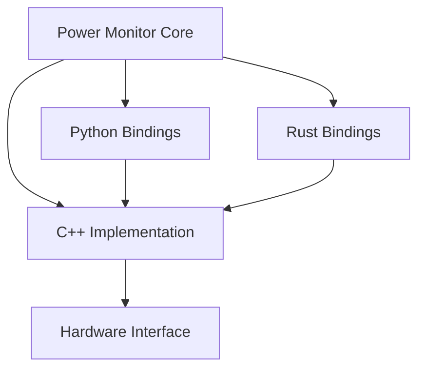
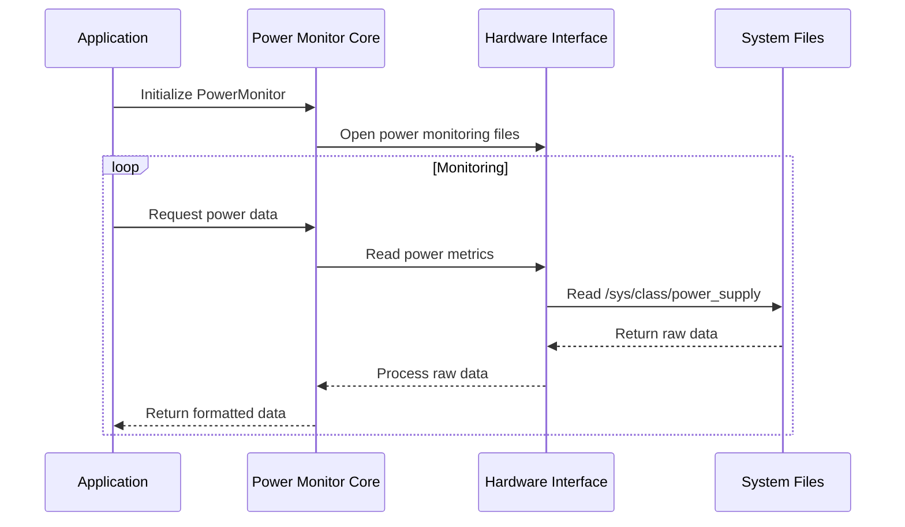

# Contributing to jetson-power-monitor

Thank you for your interest in contributing to jetson-power-monitor! This document provides detailed information about the project's architecture, implementation details, and development guidelines.

## Architecture Overview

### Core Components



### Power Monitoring Flow



## Implementation Details

### Hardware Interface Layer

The core functionality is implemented in C++ and interacts directly with the Jetson hardware through system files:

- Power consumption: `/sys/class/power_supply/battery/power_now`
- Voltage: `/sys/class/power_supply/battery/voltage_now`
- Current: `/sys/class/power_supply/battery/current_now`

### Core Implementation

The core implementation (`src/core/`) handles:
- File I/O operations
- Data parsing and validation
- Error handling
- Resource management

### Language Bindings

#### Python Bindings
- Uses pybind11 for C++ to Python bindings
- Provides a Pythonic interface to the core functionality
- Located in `src/python/`

#### Rust Bindings
- Uses cxx for C++ to Rust bindings
- Provides safe Rust abstractions
- Located in `src/rust/`

## Development Setup

### Prerequisites
1. Install development tools:
```bash
sudo apt-get install build-essential cmake python3-dev
```

2. Install Rust toolchain:
```bash
curl --proto '=https' --tlsv1.2 -sSf https://sh.rustup.rs | sh
```

3. Install Python development packages:
```bash
pip install -r requirements-dev.txt
```

### Building from Source

1. Clone the repository:
```bash
git clone https://github.com/yourusername/jetson-power-monitor.git
cd jetson-power-monitor
```

2. Create and enter build directory:
```bash
mkdir build && cd build
```

3. Configure with CMake:
```bash
cmake -DCMAKE_BUILD_TYPE=Debug ..
```

4. Build:
```bash
make
```

5. Run tests:
```bash
ctest
```

## Development Guidelines

### Code Style

- C++: Follow Google C++ Style Guide
- Python: Follow PEP 8
- Rust: Follow standard Rust style guide

### Testing

1. Unit Tests
   - C++: Google Test framework
   - Python: pytest
   - Rust: built-in test framework

2. Integration Tests
   - Located in `tests/integration/`
   - Test cross-language functionality

### Documentation

1. Code Documentation
   - C++: Doxygen style
   - Python: Google style
   - Rust: Standard documentation comments

2. API Documentation
   - Update API documentation for any changes
   - Include examples for new features

### Pull Request Process

1. Create a new branch:
```bash
git checkout -b feature/your-feature-name
```

2. Make your changes and commit:
```bash
git add .
git commit -m "Description of your changes"
```

3. Push to your fork:
```bash
git push origin feature/your-feature-name
```

4. Create a Pull Request on GitHub

### Review Process

1. Code Review
   - All PRs require at least one reviewer
   - Address all review comments
   - Update documentation as needed

2. CI Checks
   - All tests must pass
   - Code style checks must pass
   - Documentation must be up to date

## Common Development Tasks

### Adding New Features

1. Create feature branch
2. Implement core functionality
3. Add language bindings
4. Write tests
5. Update documentation
6. Create PR

### Fixing Bugs

1. Create bug fix branch
2. Write test to reproduce issue
3. Implement fix
4. Verify fix with tests
5. Update documentation if needed
6. Create PR

### Performance Optimization

1. Profile the code
2. Identify bottlenecks
3. Implement optimizations
4. Measure improvements
5. Document changes
6. Create PR

## Getting Help

- Open an issue for bugs or feature requests
- Join our community chat
- Check existing documentation
- Contact maintainers

## Release Process

1. Version Bump
   - Update version numbers in all relevant files
   - Update CHANGELOG.md

2. Testing
   - Run all tests
   - Perform integration testing
   - Test on different Jetson devices

3. Documentation
   - Update API documentation
   - Update examples
   - Review README files

4. Release
   - Create GitHub release
   - Update package repositories
   - Announce release

## License

By contributing, you agree that your contributions will be licensed under the project's MIT License. 